# Catálogo de Productos - Pinturas San Pedro

## Índice de Categorías

- [Vinilos](#vinilos)
- [Anticorrosivo](#anticorrosivo)
- [Esmaltes](#esmaltes)
- [Tráfico Pesado](#tráfico-pesado)
- [Estucos](#estucos)
- [Impermeabilizante](#impermeabilizante)
- [Herramientas](#herramientas)
- [Rodillos](#rodillos)
- [Brochas](#brochas)

---

## Vinilos

### Vinilo acrílico

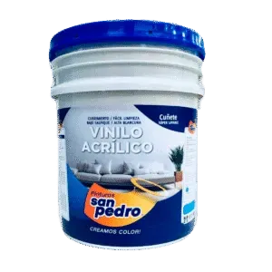

**Descripción:** Pintura acrílica de acabado mate diseñada para ofrecer alta cobertura y durabilidad en espacios interiores.

**Características:**
- Acabado mate lavable
- Alto cubrimiento
- Bajo olor
- Excelente nivelación

**Presentaciones disponibles:**
- Cuñete
- Medio
- Galón

**Certificaciones:**
- NTC 1335 (algunas referencias)

**Colores disponibles:**
- Blanco
- Almendra
- Rojo

---

### Vinilo tipo 2 Semilavable

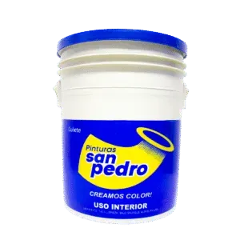

**Descripción:** Pintura para interiores con acabado mate, desarrollada para proporcionar un cubrimiento eficiente y un rendimiento superior en cada aplicación.

**Características:**
- Acabado mate
- Buen cubrimiento
- Rendimiento óptimo
- Bajo olor
- Superficies uniformes

**Presentaciones disponibles:**
- Cuñete
- Medio
- Galón

**Certificaciones:**
- NTC 1335 (algunas referencias)

---

### Vinilo tipo coraza

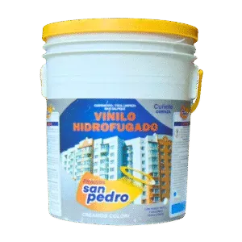

**Descripción:** Pintura de alto rendimiento con acabado satinado y tecnología hidrófuga, ideal para proteger fachadas y muros bajo condiciones de humedad.

**Características:**
- Acabado satinado
- Propiedades hidrofugantes
- Alta resistencia a la intemperie
- Uso en fachadas e interiores

**Presentaciones disponibles:**
- Cuñete
- Medio
- Galón

---

### Vinilo tipo 2 certificado

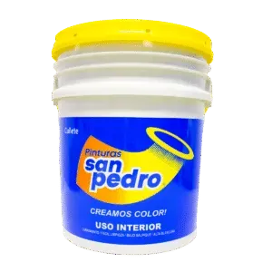

**Descripción:** Pintura económica de calidad certificada para interiores, ideal para proyectos que requieren un balance entre presupuesto y buen acabado.

**Características:**
- Costo eficiente
- Calidad certificada
- Fácil de aplicar

**Presentaciones disponibles:**
- Cuñete
- Medio
- Galón

---

### Vinilo acrílico tipo 1 certificado

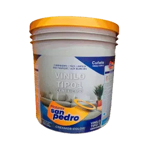

**Descripción:** Producto acrílico de nivel superior con certificación de calidad, diseñado para obtener acabados profesionales de gran resistencia y lavabilidad.

**Características:**
- Acabado mate lavable
- Cubrimiento excepcional
- Bajo olor
- Nivelación profesional
- Certificación NTC 1335

**Presentaciones disponibles:**
- Cuñete
- Medio
- Galón

**Certificaciones:**
- NTC 1335

---

### Vinilo tipo 3

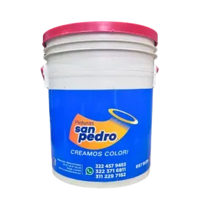

**Descripción:** Pintura básica de alta rotación para techos o primeras manos, ofreciendo una solución rentable para la renovación de espacios.

**Características:**
- Económica
- Ideal para techos
- Aplicación sencilla

**Presentaciones disponibles:**
- Cuñete
- Medio
- Galón

---

## Anticorrosivo

### Anticorrosivo

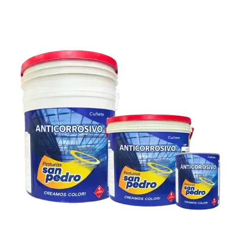

**Descripción:** Pintura técnica formulada para detener la progresión de la oxidación y proteger estructuras metálicas en diversos entornos.

**Características:**
- Protección contra la corrosión
- Base para esmaltes
- Resistencia climática

**Presentaciones disponibles:**
- Cuñete
- Medio
- Galón

**Usos:**
- Primera mano para superficies metálicas en interiores y exteriores
- Ventanas, rejas, puentes, barandas
- Estructuras metálicas con exposición ambiental moderada

**Beneficios:**
- Previene la formación de óxido
- Mejora la adhesión del esmalte
- Fácil aplicación 
- Con resistencia y durabilidad

**Aplicación:** Listo para usar. Aplicable con rodillo o brocha. Se disuelve con thinner o varsol.

---

## Esmaltes

### Esmalte Especial

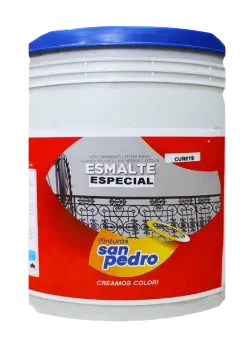

**Descripción:** Esmalte sintético de uso general diseñado para el embellecimiento y la protección duradera de elementos en metal y madera.

**Características:**
- Protección duradera
- Acabado decorativo
- Alta adherencia

**Presentaciones disponibles:**
- Cuñete
- Galón
- 1/4
- 1/8

**Usos:**
- Rejas, puertas, ventanas
- Marcos, persianas
- Tuberías, zócalos

---

### Esmalte Premium

**Descripción:** Esmalte de calidad superior que proporciona un acabado estético impecable y una barrera protectora reforzada contra el desgaste.

**Características:**
- Protección de alto nivel
- Excelente acabado
- Calidad premium

**Presentaciones disponibles:**
- Cuñete
- Galón
- 1/4
- 1/8

**Usos:**
- Rejas, puertas, ventanas
- Marcos, persianas
- Tuberías, zócalos

---

### Esmalte Tipo 1

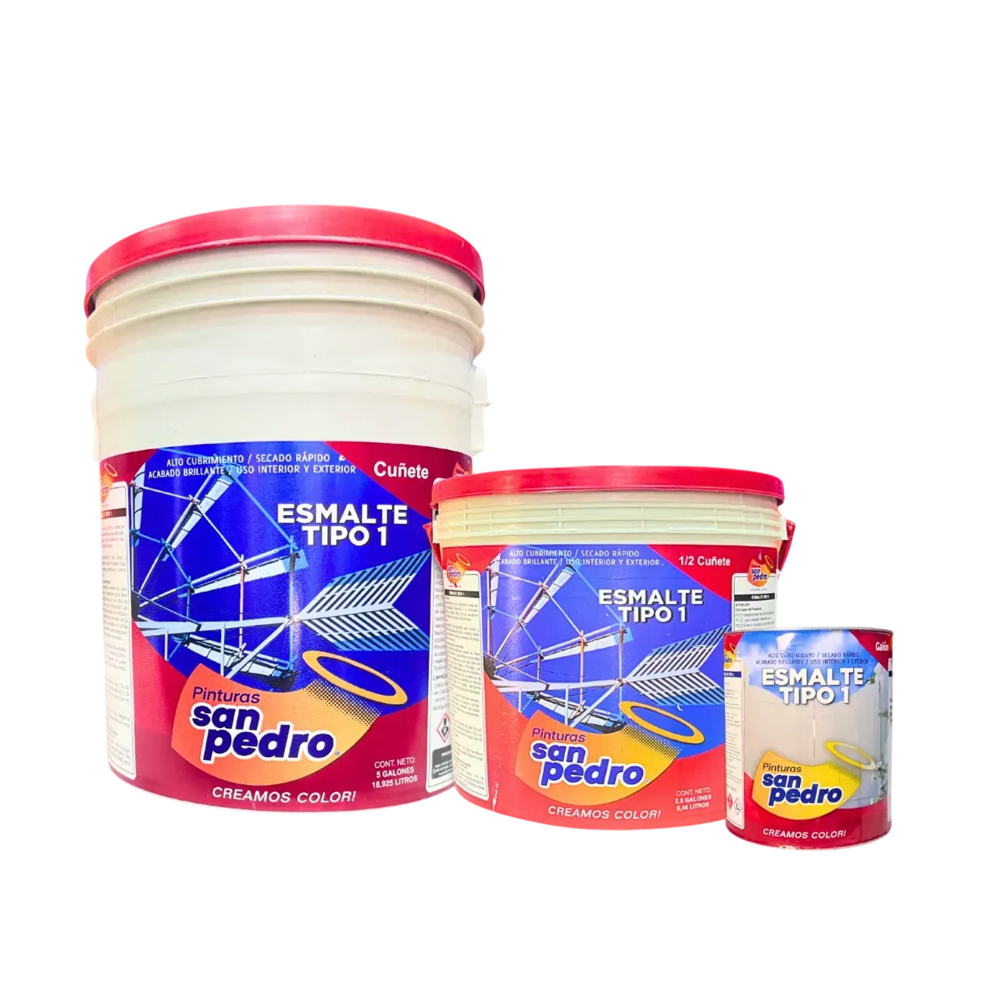

**Descripción:** Pintura versátil enfocada en el mantenimiento estándar de superficies metálicas y de madera con resultados consistentes.

**Características:**
- Protección estándar
- Versatilidad de uso
- Resultados uniformes

**Presentaciones disponibles:**
- Cuñete
- Medio
- 1/4

**Usos:**
- Rejas, puertas, ventanas
- Marcos, persianas
- Tuberías, zócalos

---

### Esmalte a base agua

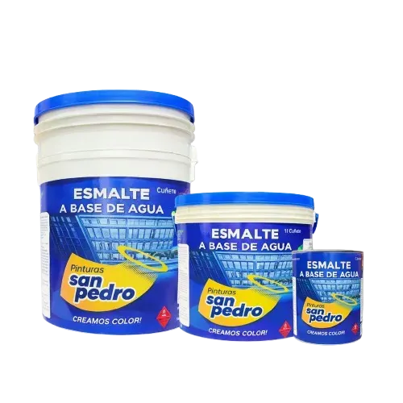

**Descripción:** Esmalte ecológico formulado sin solventes agresivos, ideal para proyectos sostenibles que requieren protección en metal y madera.

**Características:**
- Fórmula base agua
- Bajo impacto ambiental
- Fácil limpieza
- Protección efectiva

**Presentaciones disponibles:**
- Cuñete
- Medio
- Galón

**Usos:**
- Rejas, puertas, ventanas
- Marcos, persianas
- Tuberías, zócalos

---

## Tráfico Pesado

### Tráfico Pesado

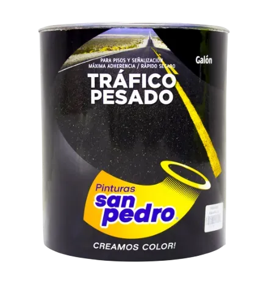

**Descripción:** Pintura de alta resistencia diseñada para resistir el roce constante y las condiciones climáticas en la demarcación vial.

**Características:**
- Resistencia al tráfico
- Secado extra rápido
- Larga durabilidad

**Presentaciones disponibles:**
- Cuñete
- Galón
- Medio Cuñete

**Usos:**
- Estacionamientos
- Carreteras
- Zonas industriales

---

## Estucos

### Estuco Plástico Acrílico

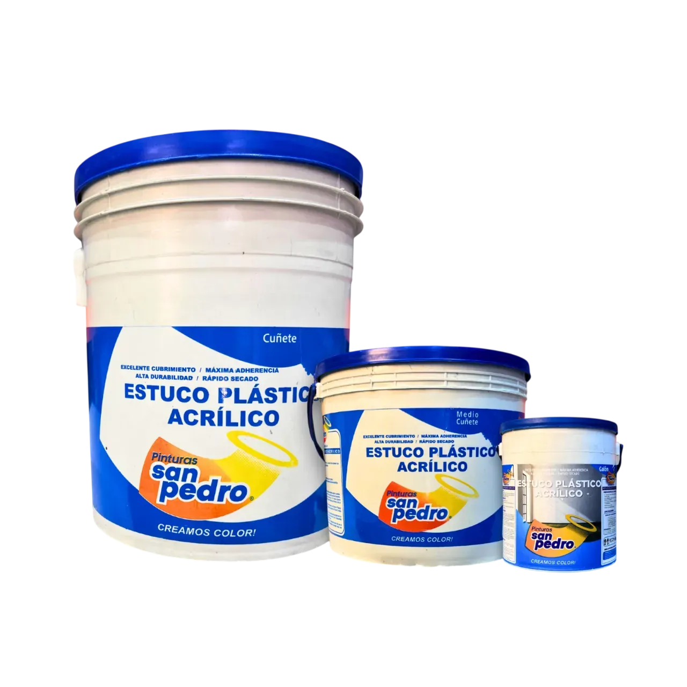

**Descripción:** Masa lista para suavizar paredes y ocultar imperfecciones, proporcionando la base perfecta para cualquier tipo de pintura.

**Características:**
- Acabado liso premium
- Alta adherencia
- Lijado sencillo

**Presentaciones disponibles:**
- Cuñete
- Medio
- Galón

**Usos:**
- Paredes interiores
- Superficies de madera en interiores
- Aplicación sobre pañetes antes de vinilo o esmalte

---

### Graniplast

**Descripción:** Revestimiento plástico que permite crear texturas decorativas resistentes a la intemperie y de gran impacto visual.

**Características:**
- Textura decorativa
- Resistencia exterior
- Gran durabilidad

**Presentaciones disponibles:**
- Cuñete
- Medio
- Galón

**Usos:**
- Interiores y exteriores
- Acabados modernos y resistentes

---

### Carraplast

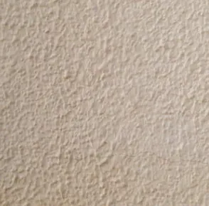

**Descripción:** Revestimiento versátil diseñado para ofrecer acabados flexibles y de alta adherencia en muros exteriores e interiores.

**Características:**
- Alta flexibilidad
- Excelente adherencia
- Variedad de acabados

**Presentaciones disponibles:**
- Cuñete
- Medio
- Galón

**Usos:**
- Protección y embellecimiento de superficies

---

### Pasta Acrílica

**Descripción:** Pasta especializada para la preparación técnica de superficies, asegurando un plano uniforme antes de los acabados finales.

**Características:**
- Nivelación de superficies
- Base técnica
- Acabado uniforme

**Presentaciones disponibles:**
- Cuñete
- Medio
- Galón

**Beneficios:**
- Garantiza un acabado uniforme y profesional
- Mejora la apariencia final de la pintura

---

## Impermeabilizante

### Impermeabilizante

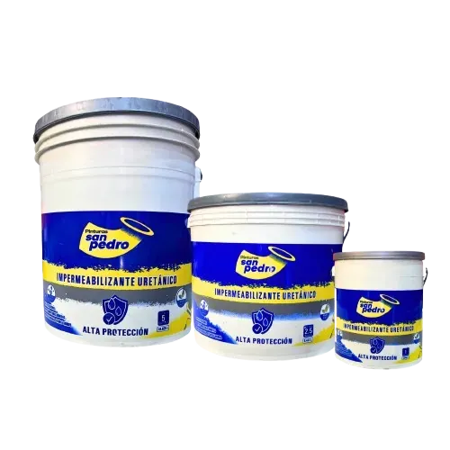

**Descripción:** Sistema de protección hidrófuga diseñado para sellar superficies y prevenir filtraciones críticas en cubiertas y fachadas.

**Características:**
- Barrera contra humedad
- Alto rendimiento elástico
- Resistencia a climas extremos
- Protección estructural

**Presentaciones disponibles:**
- Cuñete
- Medio
- Galón

**Beneficios:**
- Con durabilidad
- Protección frente al clima y la humedad

---

## Herramientas

### Recambios para rodillos

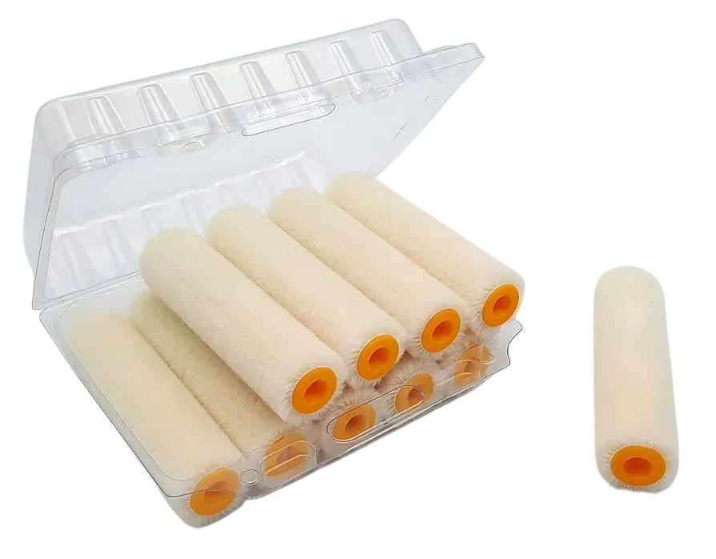

**Descripción:** Repuestos fabricados con diferentes largos de lana, ideales para renovar el rodillo y mantener un acabado uniforme.

**Características:**
- Variedad de fibras
- Fácil instalación
- Renovación de herramienta

**Presentaciones disponibles:**
- Variedad de tamaños

**Usos:**
- Mantenimiento de rodillos
- Reemplazo de recubrimiento

---

### Bandejas

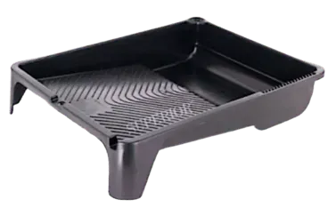

**Descripción:** Recipiente estructurado que facilita la distribución uniforme de la pintura y permite una carga controlada del rodillo.

**Características:**
- Carga equilibrada
- Zona de descarga integrada
- Estructura resistente

**Presentaciones disponibles:**
- Estándar

**Usos:**
- Verter pintura
- Carga de rodillos
- Eliminar exceso

---

### Cinta de Enmascarar Cellux / Estándar

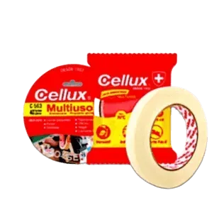

**Descripción:** Cinta adhesiva de alta precisión diseñada para proteger áreas específicas y obtener líneas de pintura limpias sin dejar residuos.

**Características:**
- Alta precisión
- Uso multipropósito
- Remoción limpia y sencilla

**Presentaciones disponibles:**
- 24 mm x 40 yd
- 40 mm x 40 mts

**Usos:**
- Trabajos de precisión
- Protección de superficies
- Líneas limpias

---

### Lonas y plásticos protectores

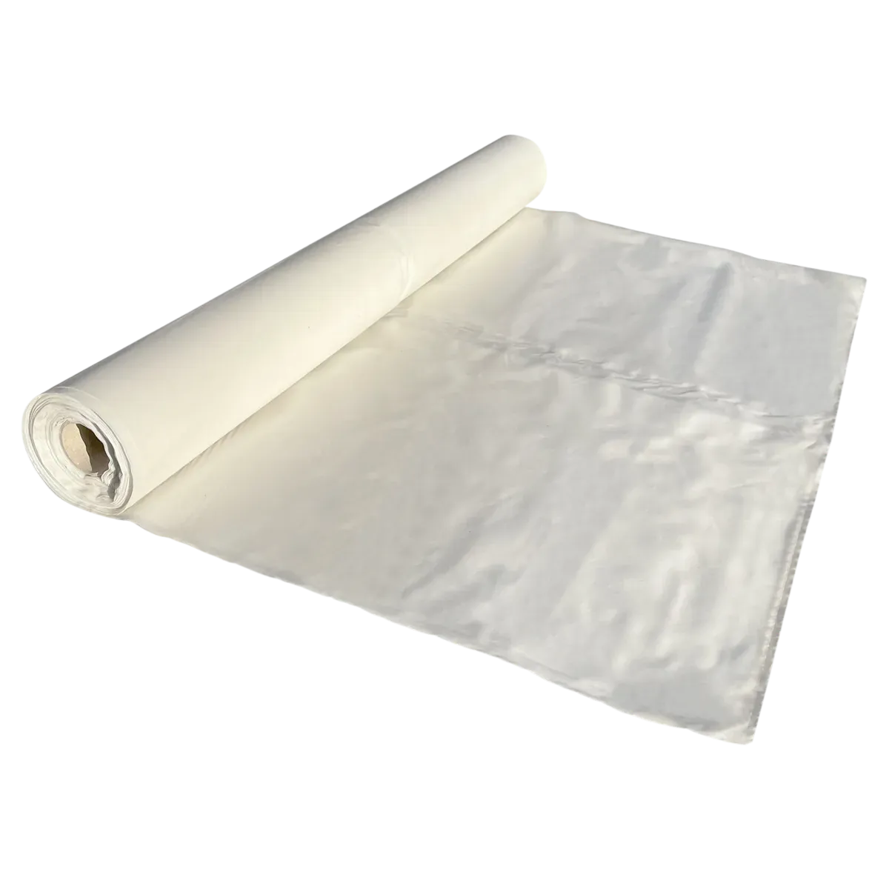

**Descripción:** Cubiertas resistentes diseñadas para proteger muebles y pisos de salpicaduras, polvo y manchas durante trabajos de pintura.

**Características:**
- Protección integral
- Material resistente
- Reutilizable

**Presentaciones disponibles:**
- Variedad de tamaños

**Usos:**
- Protección de muebles
- Cubrir pisos
- Protección de superficies

---

### Cartón corrugado

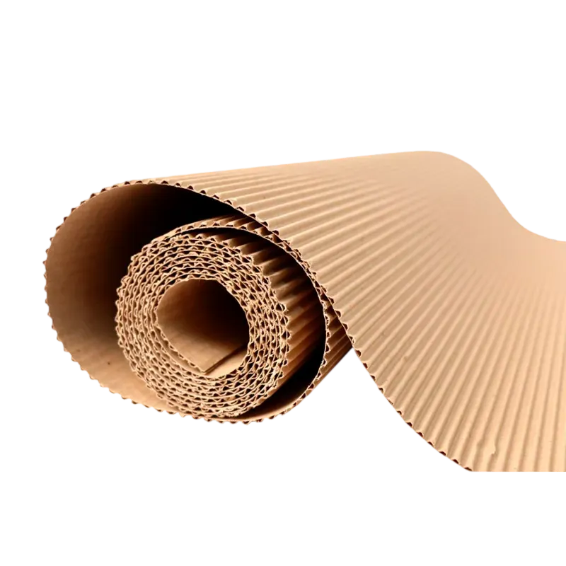

**Descripción:** Material de protección robusto utilizado para cubrir pisos y superficies amplias durante procesos de remodelación y pintura.

**Características:**
- Protección de alto impacto
- Fácil despliegue
- Resistencia al tráfico

**Presentaciones disponibles:**
- Variedad de tamaños

**Usos:**
- Protección de pisos
- Cubrir muebles
- Protección durante pintura

---

### Disolventes

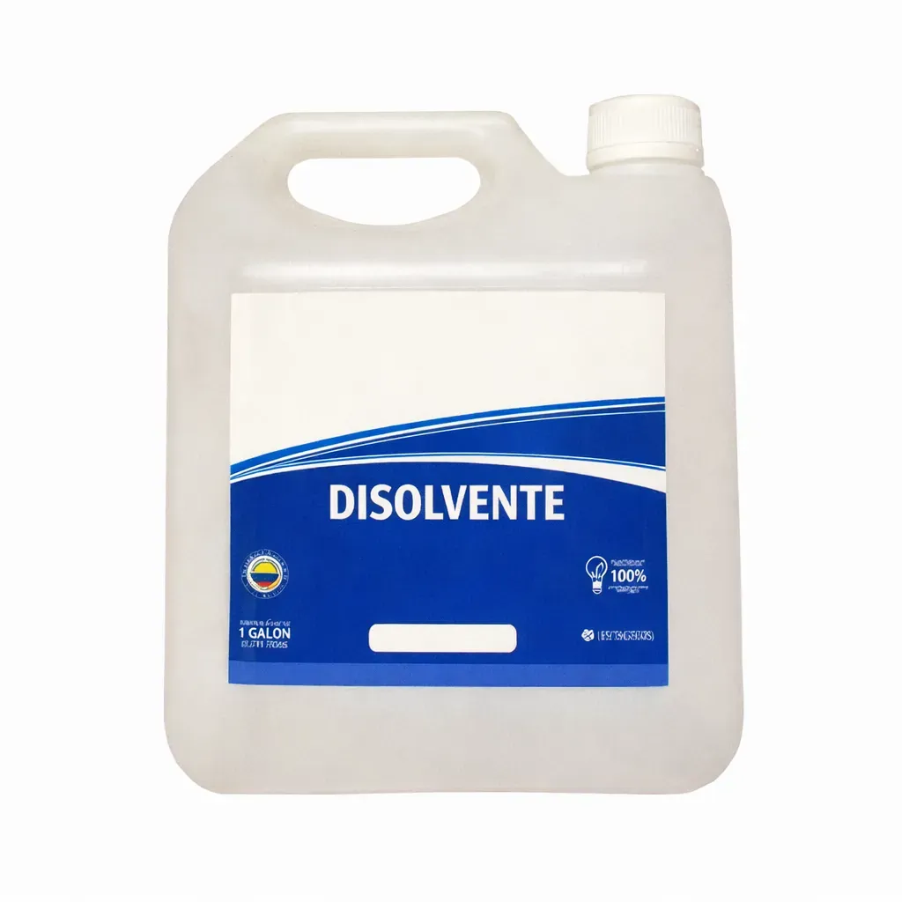

**Descripción:** Sustancia especializada diseñada para la dilución de pinturas, limpieza profunda de herramientas y preparación técnica de superficies.

**Características:**
- Limpieza efectiva
- Dilución controlada
- Uso técnico

**Presentaciones disponibles:**
- Galón
- Medio

**Usos:**
- Limpieza de herramientas
- Preparación de superficies

---

### Mezclador

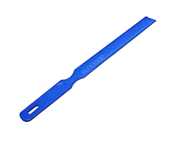

**Descripción:** Accesorio ergonómico diseñado para batir la pintura, asegurando una integración completa de pigmentos y resinas.

**Características:**
- Mezcla homogénea
- Material plástico duradero
- Fácil manejo

---

### Destapacuñete

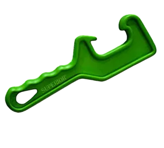

**Descripción:** Herramienta práctica fabricada para abrir envases de gran tamaño de manera segura, rápida y sin desperdicios.

**Características:**
- Apertura de seguridad
- Prevención de daños al envase
- Uso profesional

---

### Espátula Plástica

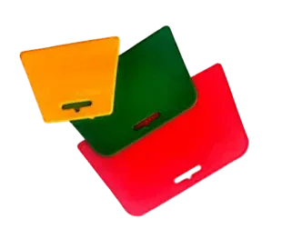

**Descripción:** Herramientas ligeras y flexibles ideales para la aplicación de masilla y el resane de pequeñas imperfecciones en muros.

**Características:**
- Alta flexibilidad
- Peso ligero
- Ideal para resanes

**Presentaciones disponibles:**
- 4"
- 5"
- 6"

---

### Espátula Boreal Acero al Carbón

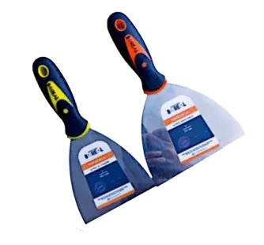

**Descripción:** Herramienta profesional de alta resistencia diseñada para raspar superficies difíciles o aplicar materiales de alta densidad.

**Características:**
- Durabilidad extrema
- Acero al carbón forjado
- Uso pesado

**Presentaciones disponibles:**
- 4"
- 5"

---

### Cepillo de Alambre Todo Uso

**Descripción:** Cepillo de cerdas metálicas diseñado para la remoción profunda de óxido, pintura vieja y limpieza técnica de herramientas.

**Características:**
- Remoción de corrosión
- Cerdas de alta resistencia
- Limpieza profunda

---

### Lija de Agua Negra

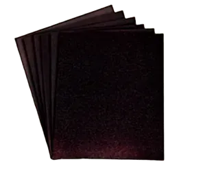

**Descripción:** Material abrasivo de grano fino diseñado para procesos de lijado que requieren lubricación con agua para obtener acabados extra suaves.

**Características:**
- Lijado de precisión
- Acabado terso
- Uso húmedo

**Presentaciones disponibles:**
- Granos 60 a 600

---

### Lija Roja en Seco

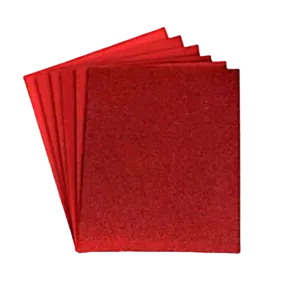

**Descripción:** Material abrasivo optimizado para procesos de desbaste y nivelación de madera o muros sin necesidad de utilizar líquidos.

**Características:**
- Desbaste eficiente
- Uso en seco
- Especial para madera y muro

**Presentaciones disponibles:**
- Granos 60 a 600

---

### Pasta de Pulir Mercury

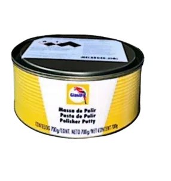

**Descripción:** Compuesto abrasivo de alta gama desarrollado para restaurar el brillo y proporcionar un acabado espejo en superficies pintadas.

**Características:**
- Brillo intenso
- Acabado tipo espejo
- Abrasión controlada

**Presentaciones disponibles:**
- 700 g

---

### Disco de Desbaste y Pulido

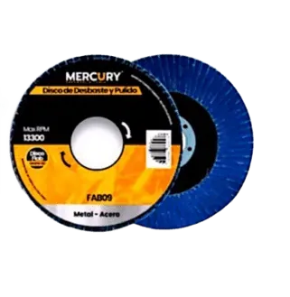

**Descripción:** Disco abrasivo especializado para procesos de esmerilado, pulido y nivelación de superficies metálicas y de madera.

**Características:**
- Grano 60 optimizado
- Uso dual metal/madera
- Desbaste rápido

---

### Veteador WI 4+6"

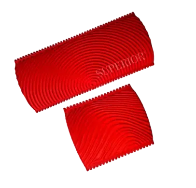

**Descripción:** Herramienta decorativa con aplicador de caucho diseñada para simular las vetas naturales de la madera en diversas superficies.

**Características:**
- Efecto madera realista
- Caucho flexible
- Fácil de limpiar

**Presentaciones disponibles:**
- 4+6"

---

### Veteador SBWR-2.5"

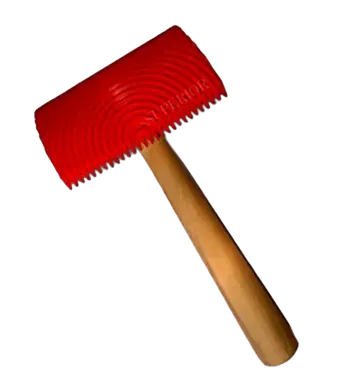

**Descripción:** Herramienta de acabado equipada con mango de madera, ideal para replicar motivos leñosos con gran detalle decorativo.

**Características:**
- Detalle definido
- Agarre ergonómico
- Larga durabilidad

**Presentaciones disponibles:**
- 2.5"

---

### Veteador SB-PY 4"

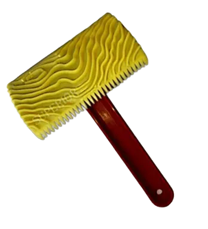

**Descripción:** Accesorio decorativo con mango ergonómico diseñado para lograr acabados que imitan la apariencia de maderas naturales.

**Características:**
- Acabado tipo madera
- Mango de alta resistencia
- Versatilidad

**Presentaciones disponibles:**
- 4"

---

### Veteador SB-PB 5"

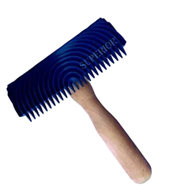

**Descripción:** Herramienta de gran tamaño diseñada para imitar vetas de madera en áreas extensas de forma rápida y eficiente.

**Características:**
- Cobertura amplia
- Efecto natural
- Ideal para grandes áreas

**Presentaciones disponibles:**
- 5"

---

## Rodillos

### Rodillo Popular 9"

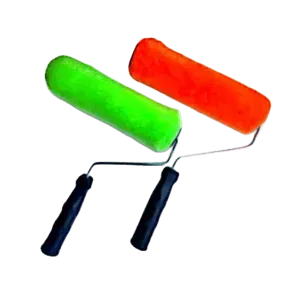

**Descripción:** Herramienta de aplicación fabricada con sistema de termo fusión que garantiza durabilidad y un rendimiento constante en pinturas base agua.

**Características:**
- Termo fusión sin costuras
- Alta durabilidad de felpa
- Ideal para vinilos

**Presentaciones disponibles:**
- 9"

---

### Rodillo Felpa Semiprofesional 9"

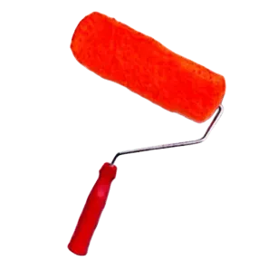

**Descripción:** Rodillo de alta calidad diseñado para proporcionar acabados superiores en superficies lisas o semirrugosas con pinturas base agua.

**Características:**
- Felpa seleccionada
- Acabado de alta gama
- Sin desprendimiento

**Presentaciones disponibles:**
- 9"

---

### Rodillo Profesional 9" Anillo

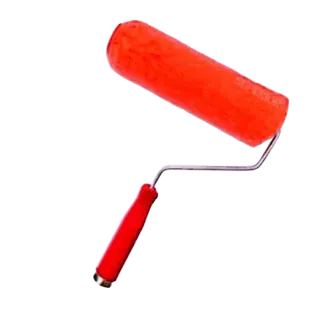

**Descripción:** Herramienta profesional con felpa de alta densidad desarrollada para obtener coberturas uniformes sin dejar huellas en la superficie.

**Características:**
- Densidad industrial
- Zero huella
- Carga máxima de pintura

**Presentaciones disponibles:**
- 9"

---

### Rodillo Hilo Antigota 9"

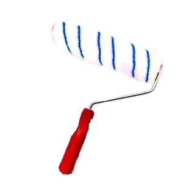

**Descripción:** Rodillo de alta tecnología fabricado con microfibra diseñado para minimizar el salpicado y maximizar la descarga de pintura técnica.

**Características:**
- Tecnología antigota
- Microfibra avanzada
- Compatible con epóxicos

**Presentaciones disponibles:**
- 9"

---

### Rodillo Espuma 9"

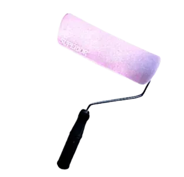

**Descripción:** Herramienta básica y ligera fabricada en poliuretano, ideal para aplicaciones sencillas y retoques rápidos con pinturas base agua.

**Características:**
- Espuma de alta porosidad
- Peso ligero
- Económico y efectivo

**Presentaciones disponibles:**
- 9"

---

### Rodillo Teja de Felpa Industrial

**Descripción:** Rodillo ergonómico con diseño especializado para adaptarse a la forma ondulada de las tejas, facilitando un cubrimiento homogéneo.

**Características:**
- Forma anatómica para teja
- Aplicación ergonómica
- Cubrimiento total

**Presentaciones disponibles:**
- Estándar

---

### Mini Rodillos Hilo Antigota

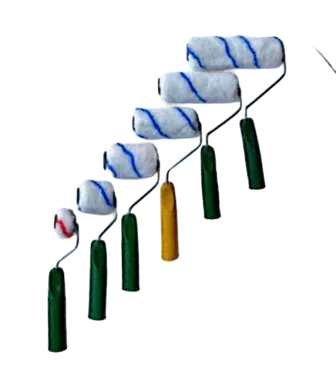

**Descripción:** Mini rodillos de microfibra diseñados para trabajar con precisión en marcos, esquinas y áreas de difícil acceso.

**Características:**
- Precisión en detalles
- Fibras antigota
- Uso en espacios reducidos

**Presentaciones disponibles:**
- 1"
- 2"
- 3"
- 4"
- 5"
- 6"

---

### Rodillo Junior

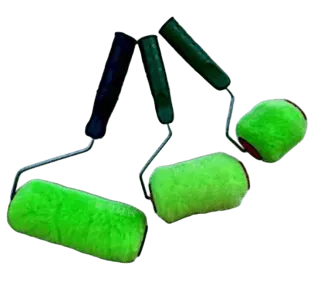

**Descripción:** Versión compacta del rodillo de felpa industrial, ideal para realizar detalles y acabados finales en espacios reducidos.

**Características:**
- Tamaño compacto
- Felpa industrial resistente
- Acabado detallado

**Presentaciones disponibles:**
- 7"
- 5"
- 3"

---

### Rodillo Texturizador

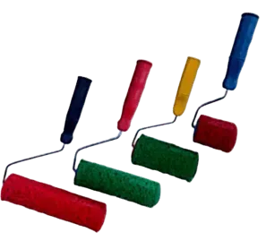

**Descripción:** Herramienta con relieve diseñada para crear efectos decorativos rústicos y texturas personalizadas en paredes y techos.

**Características:**
- Efecto texturizado
- Relieve definido
- Versatilidad creativa

**Presentaciones disponibles:**
- 9"
- 7"
- 5"
- 3"

---

### Rodillo Epóxico 9"

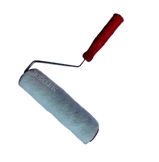

**Descripción:** Herramienta reforzada diseñada para resistir componentes químicos agresivos presentes en pinturas epóxicas y de tráfico.

**Características:**
- Resistencia química
- Fijación de felpa extrema
- Uso industrial

**Presentaciones disponibles:**
- 9"

---

### Rodillo Teja Ovejero

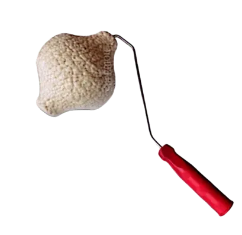

**Descripción:** Rodillo de alta carga con material ovejero diseñado para cubrir eficazmente las irregularidades de tejas y superficies muy rugosas.

**Características:**
- Carga máxima de pintura
- Adaptación a rugosidades
- Uso en exteriores

**Presentaciones disponibles:**
- Estándar

---

### Rodillo Felpa Ovejera 9"

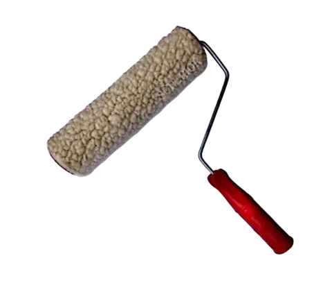

**Descripción:** Herramienta de alta absorción diseñada para la aplicación rápida y eficiente de pintura en superficies de gran extensión.

**Características:**
- Absorción superior
- Rapidez de cobertura
- Uso en muros amplios

**Presentaciones disponibles:**
- 9"

---

## Brochas

### Brocha Cerda Popular

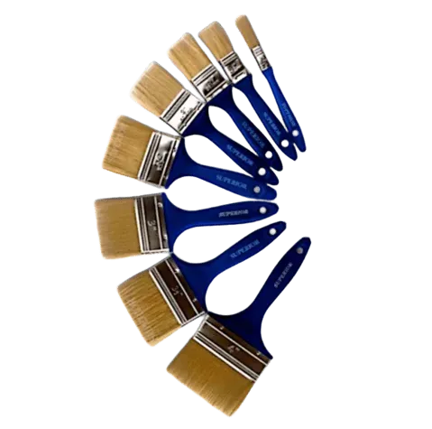

**Descripción:** Herramienta versátil y económica diseñada para la aplicación de diversos tipos de pintura en tareas de mantenimiento general.

**Características:**
- Polivalencia de uso
- Cerdas equilibradas
- Costo accesible

**Presentaciones disponibles:**
- 2 1/2"
- 3"
- 4"

---

### Brocha Cerda Premium

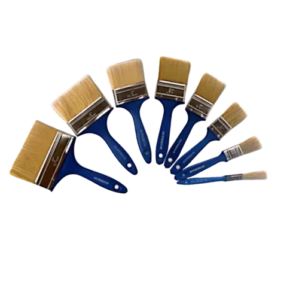

**Descripción:** Brocha de calidad superior diseñada para ofrecer una excelente retención de pintura y acabados profesionales en cualquier superficie.

**Características:**
- Retención de carga óptima
- Acabado sin rayas
- Durabilidad profesional

**Presentaciones disponibles:**
- 1/2"
- 1"
- 1 1/2"
- 2"
- 2 1/2"
- 3"
- 4"
- 5"

---

## Información de Contacto

Para más información sobre nuestros productos, contáctanos:

- **WhatsApp:** +57 322 371 6811
- **Ubicación:** Pinturas San Pedro

---

*Última actualización: Catálogo completo de productos disponibles*
